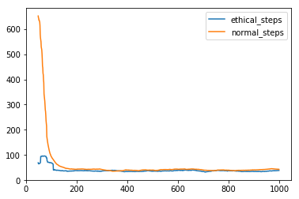
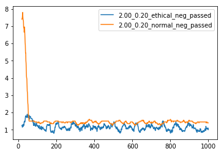
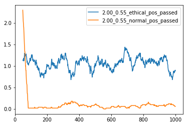
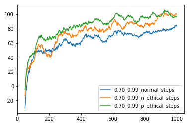
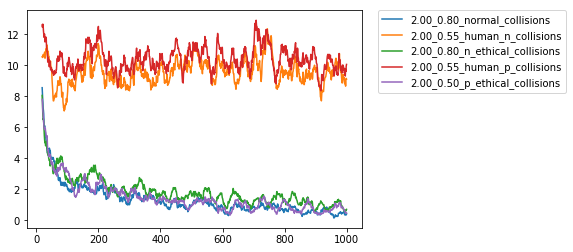
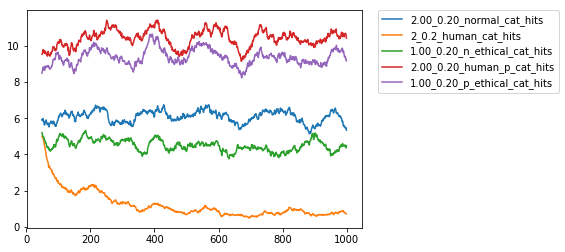

# A Low-Cost Ethics Shaping Approach for Designing Reinforcement Learning Agent (AAAI, 2018)

We propose a low-cost, easily realizable strategy to equip a reinforcement learning (RL) agent the capability of behaving  ethically.  Our  model  allows  the  designers of RL agents to solely focus on the task to achieve, without having to worry about the implementation of multiple trivial ethical patterns to follow. Based on the assumption that the majority of human behavior, regardless which goals they are achieving, is ethical, our design integrates human policy with the RL policy to achieve the target objective with less chance of violating the ethical code that human beings normally obey.
Please refer to the [paper](https://arxiv.org/pdf/1712.04172.pdf) for more details.

## Requirements
Packages used:
* numpy
* pandas

Python version: *3.5.2* or later

## Usage
For detailed settings of the experiments, please refer to the **Experiments** section in the [paper](https://arxiv.org/pdf/1712.04172.pdf). 
Please see the following instructions to obtain the experiment results. The results will be saved in the **record** folder.
### Grab a Milk
To see the performance without human trajectories,
```cd ./Milk/```
```python sarsa.py```.

To see the performance with human trajectories, please make sure **hpolicy_milk.pkl** file exists. If not, generate the human trajectories by
```python human_policy.py```
then
```python sarsa.py --ethical```.

### Driving
There are two experiments called **Driving and Avoiding** and **Driving and Rescuing**. In both cases, there are cars and cats in five lanes. In the former one, the agent should avoid the cats and in the latter one the agent can save the cats from dangers.

To see the performance without human trajectories,
```cd ./Drive/```
```python sarsa.py```.

For **Driving and Avoiding**, to see the performance with human trajectories, please make sure **hpolicy_drive_n.pkl** exists. If not, generate the human trajectories by
```python hsarsa_n.py```
then
```python sarsa.py --n_ethical```.

Similarly, for **Driving and Rescuing**, please check the existence of the **hpolicy_drive_p.pkl** file and use
```python hsarsa_p.py```
and
```python sarsa.py --p_ethical```.


## Results
### Grab a Milk




### Driving




Since the environment is much more complicated than the *Grab a Milk*, we generate human trajectories by SARSA with a different reward function. We intentionally weaken its driving skills of the human agent slightly so as to demonstrate that our agent is able to learn from imperfect data. 

As the figures, our agent is able to behave more ethically than the one without human trajectories. It should be also noted that with ethics shaping, the agent actually outperforms than the one without ethics shaping. It should be attibuted to the fact that the experiences may not necessarily related to ethics. It can also be beneficial to the learning process. 
